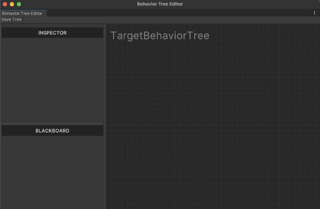
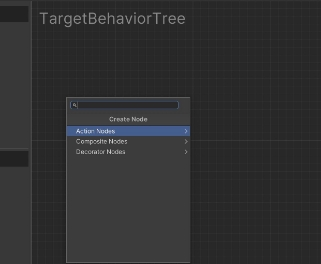
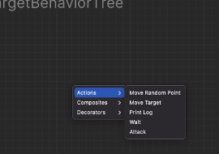
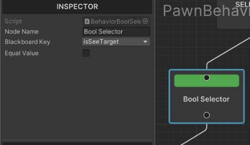
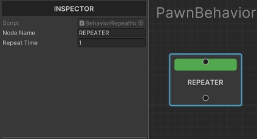
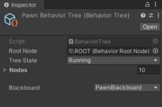

# G-AI
This is sample Behaviour Tree and Blackkboard for Game AI.
Download [G-AI.unitypackage](https://github.com/Hot-G/G-AI/G-AI.unitypackage)

G-AI Documentation

G-AI

**Contents** 

1.Getting Started 3

1. Key Features 3
1. Install 3
1. Creating New Behavior Tree 3
1. Create Node 4
1. Action Nodes 4
1. Composite Nodes 4
1. Decorator Nodes 4
2. Behavior Tree Node Reference 5
1. Composite Nodes 5
   1. Selector 5
   1. Sequence 5
1. Decorator Nodes 6
   1. Bool Selector 6
   1. Repeater 6
1. Action Nodes 7

3. Blackboard 7
1. Create Blackboard 7
1. Assign Blackboard To Behavior Tree 7

**1.Getting Started** 

G-AI is a tool used to create behavior tree and blackboard. Tool can be used to create artificial intelligence (AI) for non-player characters in your projects. While the Behavior Tree asset is used to execute branches containing logic, to determine which branches should be executed, the Behavior Tree relies on another asset called a Blackboard which serves as the "brain" for a Behavior Tree.

1. Key Features

- It’s free and open-source
- Fast and simple to use
- Create quick ai
- Create own node
- Use blackboard

2. Install

After the G-AI package is downloaded from the Github, import into project. That’s it!

3. Creating New Behavior Tree

To create a new Behavior Tree in the project, go to **Create/AI/Behavior Tree**. This will create a new Behavior Tree. Double click on asset and open **Behavior Tree Editor**.

4. Create Node

To create a node in behavior tree, click the right button and open context menu. This Context menu includes all class derived from BehaviorNode. 

If you want to open **search panel**, press the Spacebar and open it.



1. Action Nodes

Action Nodes have a input but it don’t have output. It used for action (Move Target, Attack e.g)

2. Composite Nodes

Composite Nodes have a single input and multiple output. It used for selector or sequence.

3. Decorator Nodes

Decorator Nodes also known as conditionals. These attach to another node and make decisions on whether or not a branch in the tree, or even a single node, can be executed.

2. **Behavior Tree Node Reference** 

The node that serves as the starting point for a Behavior Tree is a **Root node**. This is a unique node within the tree, and it executed every frame when tree is enable. It can have only one connection.

1. Composite Nodes

**Composite** nodes define the root of a branch, and the base rules for how that branch is executed.

1. Selector

**Selector** Nodes execute their children from left to right. If current child returns fail, execute the other child.

2. Sequence

**Sequence** nodes execute their children from left to right. They stop executing when one of their children fails. If a child fails, then the Sequence fails.

2. Decorator Nodes

Decorator nodes also known as conditionals. These attach to another node and make decisions on whether or not a branch in the tree, or even a single node, can be executed.

1. Bool Selector

**Bool Selector** compares two boolean and if it’s true, nodes execute the child.

2. Repeater

**Repeater** nodes execute child n times. It can changeable on inspector.

3. Action Nodes

These are the leaves of the Behavior Tree, these nodes are the actionable things to do and don't have an output connection.

3. **Blackboard** 

A blackboard is a simple place where data can be written and read for decision making purposes. A blackboard can be used by a single AI pawn, shared by a squad, or used for any other purpose where it’s convenient to have a central place to look up relevant data. Blackboards are commonly used with behavior trees, but you could use them separately from behavior trees for convenience or you could make a behavior tree with no need of a blackboard.

1. Create Blackboard

To create a new Blackboard in the project, go to **Create/AI/Blackboard**. This will create a new Blackboard.

Second way is, create a c# file and inherit from Blackboard class.

2. Assign Blackboard To Behavior Tree

When selected the Behavior Tree, Inspector  shows some settings. You can select  blackboard from popup. 

